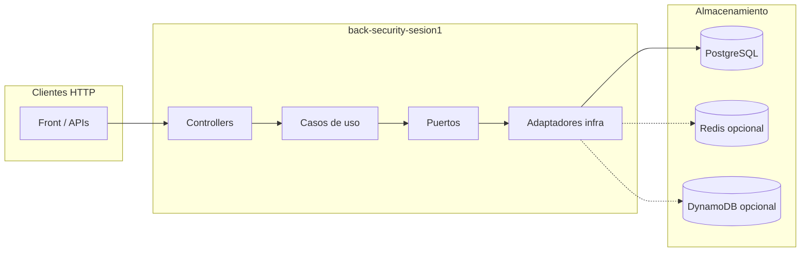

# back-security-sesion1

Servicio de autenticación y autorización (**BSG**, Sesión 1): API reactiva (**Spring WebFlux**), persistencia **R2DBC** sobre **PostgreSQL**, emisión y validación de **JWT**, y soporte opcional de **Redis** (caché de revocación de tokens) y **DynamoDB** (registro persistente de tokens revocados, p. ej. LocalStack o AWS). Derivado del proyecto `findu-spring-security`, renombrado y reubicado en este repositorio.

---

## Arquitectura

### Visión por capas

El código sigue una organización tipo **hexagonal / limpia**, con dependencias hacia el dominio y puertos que aislan la infraestructura.

| Capa | Paquete principal | Rol |
|------|---------------------|-----|
| **Presentación** | `com.bsg.security.presentation` | Controladores WebFlux, DTOs de entrada/salida, contratos HTTP. |
| **Aplicación** | `com.bsg.security.application` | Casos de uso, servicios de aplicación, **puertos** (interfaces hacia fuera: persistencia, caché, etc.). |
| **Dominio** | `com.bsg.security.domain` | Modelos y reglas de negocio independientes de frameworks. |
| **Infraestructura** | `com.bsg.security.infrastructure` | **Adaptadores**: repositorios R2DBC, clientes Redis/DynamoDB, integraciones. |
| **Configuración** | `com.bsg.security.config` | Seguridad (Spring Security reactivo), JWT, Redis, DynamoDB, propiedades. |

Los **puertos** de salida (por ejemplo revocación de tokens o usuarios) viven en `application.port.output`; las implementaciones concretas en `infrastructure.adapter`.

### Flujo de datos (resumen)



### Componentes opcionales (Redis y DynamoDB)

| Funcionalidad | Con `bsg.security.redis.enabled=true` | Con `bsg.security.redis.enabled=false` |
|---------------|--------------------------------|----------------------------------|
| Caché de revocación (rápida) | `RedisTokenRevocationCacheAdapter` | `NoOpTokenRevocationCacheAdapter` (sin caché Redis) |

| Funcionalidad | Con `bsg.security.aws.dynamodb.enabled=true` | Con `bsg.security.aws.dynamodb.enabled=false` |
|---------------|----------------------------------------|----------------------------------------|
| Persistencia de tokens revocados | Adaptador DynamoDB + cliente async | `InMemoryRevokedTokenRepositoryAdapter` (solo en memoria en el proceso) |

En **desarrollo local** suele usarse el perfil **`dev`**, que **desactiva Redis a nivel de Spring** (excluye la autoconfiguración de Redis) y deja DynamoDB desactivado por defecto, evitando levantar Redis, LocalStack o AWS.

### Perfiles Spring

| Perfil | Uso típico | PostgreSQL | SQL init | Redis | DynamoDB |
|--------|------------|------------|----------|-------|----------|
| **`dev`** | Máquina del desarrollador | Local o contenedor | `always` por defecto (schema + data en cada arranque) | **Desactivado** (autoconfig excluida) | **Desactivado** por defecto |
| **`qa`** | Integración / compose completo | Configurable por env | `never` por defecto | Activado por variable (`BSG_SECURITY_REDIS_ENABLED`) | Activado por variable (`BSG_SECURITY_AWS_DYNAMODB_ENABLED`) |
| **`pdn`** | Producción | Configurable | `never` | Obligatorio (revocación en caché) | Según `qa` importado |

El perfil por defecto en `application.yml` es **`dev`**.

---

## Requisitos

- **JDK 21** (alineado con `build.gradle` y Docker).
- **PostgreSQL** accesible (versión compatible con el driver R2DBC del proyecto; 16 es la usada en Docker Compose del monorepo).
- Opcional: **Redis** y emulador **DynamoDB** (p. ej. LocalStack) solo si quieres paridad con entornos `qa` / nube.

---

## PostgreSQL en local

### Opción A: solo base de datos con Docker (recomendada para no instalar el servidor)

Desde la raíz del monorepo (`FINDU-PROJECT`), puedes levantar únicamente Postgres:

```bash
docker compose up -d postgres
```

Por defecto (o vía `.env` en la raíz, copiado desde `.env.example`):

- Host: `localhost`
- Puerto: `5432`
- Base de datos: `findu`
- Usuario / contraseña: `findu` / `findu`

Ajusta `SPRING_R2DBC_*` si usas otros valores.

### Opción B: PostgreSQL instalado en el sistema (Windows / Linux / macOS)

1. Instala PostgreSQL desde el instalador oficial o el gestor de paquetes de tu SO.
2. Crea rol y base de datos, por ejemplo:

```sql
CREATE USER findu WITH PASSWORD 'findu';
CREATE DATABASE findu OWNER findu;
```

3. Con el perfil **`dev`**, el arranque ejecuta `schema.sql` y `data.sql` si `SPRING_SQL_INIT_MODE` es `always` (valor por defecto en `application-dev.yml`).

Si cargas el esquema a mano, puedes poner `SPRING_SQL_INIT_MODE=never` y usar los scripts en `src/main/resources/schema.sql` y `data.sql` como referencia.

---

## Ejecutar la aplicación en local (sin Redis ni DynamoDB)

La forma soportada para **no** usar Redis ni DynamoDB es el perfil **`dev`** (no basta con toggles sueltos en `qa`: en `qa` la autoconfiguración de Redis sigue activa y un Redis caído puede afectar arranque o salud).

### Variables mínimas

Copia `.env.example` a `.env` en esta carpeta (`SECURITY/back-security-sesion1/.env`) y revisa al menos:

- Conexión R2DBC (por defecto en `application-dev.yml` apunta a `localhost:5432/findu`).
- `BSG_SECURITY_AWS_DYNAMODB_ENABLED=false` (ya es el valor por defecto en `dev`).
- No necesitas Redis: en `dev`, `bsg.security.redis.enabled=false` y la autoconfiguración de Redis está excluida.

### Arranque con Gradle

```bash
cd SECURITY/back-security-sesion1
./gradlew bootRun
```

En Windows:

```powershell
.\gradlew.bat bootRun
```

Asegúrate de tener activo el perfil `dev` (por defecto en `application.yml`) o exporta:

```bash
set SPRING_PROFILES_ACTIVE=dev
```

### URLs útiles (por defecto)

| Recurso | URL |
|---------|-----|
| Base path de la API | `http://localhost:8081/security-auth` |
| Actuator health | `http://localhost:8081/security-auth/actuator/health` |
| OpenAPI | `http://localhost:8081/security-auth/v3/api-docs` |
| Swagger UI | `http://localhost:8081/security-auth/swagger-ui.html` |

Puerto y `base-path` vienen de `application.yml`; no hace falta duplicarlos en `.env` salvo que quieras sobrescribirlos por entorno.

---

## Activar Redis o DynamoDB en local (opcional)

### Redis

- Perfil **`qa`** (o **`pdn`**) con `BSG_SECURITY_REDIS_ENABLED=true` y un Redis alcanzable (`SPRING_DATA_REDIS_HOST` / `SPRING_DATA_REDIS_PORT`).
- En **`dev`**, Redis está desactivado por diseño; para probar Redis en local suele usarse **`qa`** contra un Redis en Docker (`docker compose up -d redis`) y Postgres ya migrado/poblado según tu flujo (`SPRING_SQL_INIT_MODE`).

### DynamoDB (p. ej. LocalStack)

- Pon `BSG_SECURITY_AWS_DYNAMODB_ENABLED=true` y `BSG_SECURITY_AWS_DYNAMODB_ENDPOINT` apuntando a LocalStack (p. ej. `http://localhost:4566`).
- El cliente usa credenciales de prueba fijas en código para entornos locales/emulados (ver `DynamoDbClientConfig`).

### Stack completo con Docker Compose

En la raíz `FINDU-PROJECT`, `docker-compose.yml` levanta Postgres, LocalStack (DynamoDB), Redis y la imagen de este servicio. Variables de compose: ver `.env.example` en la raíz y `SECURITY/back-security-sesion1/.env.example` para la app.

- Con **`SPRING_PROFILES_ACTIVE=qa`** (típico en compose), Redis y DynamoDB suelen ir **activados** salvo que los anules en `.env`.

---

## Tests y empaquetado

```bash
./gradlew test
./gradlew bootJar
```

La imagen Docker se construye desde el `Dockerfile` en este directorio (usada por el `docker-compose.yml` del monorepo).

---

## Documentación adicional

En el monorepo: `docs/FINDU-spring-security-documentacion.md` (si está presente en tu clon).

---

## Resumen rápido

| Objetivo | Acción |
|----------|--------|
| Solo IDE + Postgres, sin Redis ni Dynamo | Perfil **`dev`**, PostgreSQL en marcha, `./gradlew bootRun` |
| Paridad con integración (Redis + Dynamo local) | Perfil **`qa`**, LocalStack + Redis + Postgres (p. ej. `docker compose up`) |
| Desactivar Dynamo en un perfil que lo permita por variable | `BSG_SECURITY_AWS_DYNAMODB_ENABLED=false` |
| Redis “apagado” de verdad en local | Usar **`dev`** (no solo `BSG_SECURITY_REDIS_ENABLED=false` en **`qa`** si no quieres depender de Redis) |
