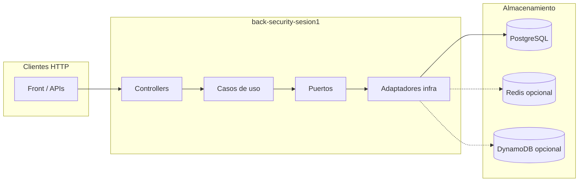

# back-security-sesion1

Servicio de autenticación y autorización (**BSG**, Sesión 1): API reactiva (**Spring WebFlux**), persistencia **R2DBC** sobre **PostgreSQL**, emisión y validación de **JWT**, y soporte opcional de **Redis** (caché de revocación de tokens) y **DynamoDB** (tokens revocados; p. ej. LocalStack o AWS).

Los mapeos dominio ↔ entidad (`UsuarioMapper`, `RolMapper`, etc.) son clases **`@Component`** escritas a mano (sin MapStruct en estos tipos), para evitar fallos del procesador de anotaciones en algunos IDEs.

---

## Arquitectura

### Visión por capas

Organización tipo **hexagonal**, con dependencias hacia el dominio y puertos que aislan la infraestructura.

| Capa | Paquete principal | Rol |
|------|-------------------|-----|
| **Presentación** | `com.bsg.security.presentation` | Controladores WebFlux, contratos HTTP. |
| **Aplicación** | `com.bsg.security.application` | Casos de uso, **puertos** (persistencia, caché, etc.). |
| **Dominio** | `com.bsg.security.domain` | Modelos y reglas independientes del framework. |
| **Infraestructura** | `com.bsg.security.infrastructure` | Adaptadores R2DBC, Redis, DynamoDB. |
| **Configuración** | `com.bsg.security.config` | Seguridad reactiva, JWT, propiedades. |

Los **puertos** de salida están en `application.port.output`; las implementaciones en `infrastructure.adapter`.

### Flujo de datos (resumen)



### Componentes opcionales (Redis y DynamoDB)

| Funcionalidad | Redis activado | Redis desactivado (`dev`) |
|---------------|----------------|---------------------------|
| Caché de revocación | `RedisTokenRevocationCacheAdapter` | `NoOpTokenRevocationCacheAdapter` |

| Funcionalidad | DynamoDB activado | DynamoDB desactivado (`dev`) |
|---------------|-------------------|-------------------------------|
| Tokens revocados persistentes | Adaptador DynamoDB | En memoria en el proceso |

En **desarrollo local** suele usarse el perfil **`dev`**, que excluye la autoconfiguración de Redis y deja DynamoDB desactivado por defecto.

### Perfiles Spring

| Perfil | Uso típico | PostgreSQL | SQL init | Redis | DynamoDB |
|--------|------------|------------|----------|-------|----------|
| **`dev`** | Desarrollo | Local / Docker (`localhost:5433`, BD `bsg_security`) | `always` por defecto | Desactivado (autoconfig excluida) | Desactivado por defecto |
| **`qa`** | Integración / compose | Configurable | `never` por defecto | Según variables | Según variables |
| **`pdn`** | Producción | Configurable | `never` | Obligatorio según despliegue | Según despliegue |

El perfil por defecto en `application.yml` es **`dev`**.

---

## Requisitos

- **JDK 21** (`java.toolchain` en `build.gradle`).
- **PostgreSQL** (en Sesión 1, el servicio Docker `postgres-security` expone **`localhost:5433`** → BD **`bsg_security`**).
- Opcional: **Redis** y **LocalStack** (DynamoDB) para paridad con `qa` / nube.

---

## PostgreSQL en local

### Opción A: Docker (recomendada)

Desde la carpeta **`Sesion 1`** del repositorio (donde está `docker-compose.yml`):

```bash
docker compose up -d postgres-security
```

Valores por defecto alineados con `application-dev.yml`:

| | |
|--|--|
| Host | `localhost` |
| Puerto | **`5433`** (mapeo host → contenedor `5432`) |
| Base de datos | **`bsg_security`** |
| Usuario / contraseña | **`bsg_security`** / **`bsg_security`** |

Variables R2DBC: ver `SPRING_R2DBC_*` en `.env.example` de este módulo.

### Opción B: PostgreSQL instalado en el sistema

Crea rol y base coherente con lo anterior, por ejemplo:

```sql
CREATE USER bsg_security WITH PASSWORD 'bsg_security';
CREATE DATABASE bsg_security OWNER bsg_security;
```

Con perfil **`dev`**, si `SPRING_SQL_INIT_MODE` es `always`, se ejecutan `schema.sql` y `data.sql` del classpath. Para cargar solo a mano: `SPRING_SQL_INIT_MODE=never` y ejecutar los SQL de `src/main/resources/` con tu cliente (`psql`, DBeaver, etc.).

---

## Ejecutar en local (sin Redis ni DynamoDB)

Usa el perfil **`dev`** (valor por defecto).

1. Copia `.env.example` → `.env` en esta carpeta y revisa `SPRING_R2DBC_*` si tu Postgres no es `localhost:5433/bsg_security`.
2. Arranque con Gradle:

```bash
./gradlew bootRun
```

Windows:

```powershell
.\gradlew.bat bootRun
```

### URLs útiles

| Recurso | URL |
|---------|-----|
| Base path API | `http://localhost:8081/security-auth` |
| Actuator health | `http://localhost:8081/security-auth/actuator/health` |
| OpenAPI | `http://localhost:8081/security-auth/v3/api-docs` |
| Swagger UI | `http://localhost:8081/security-auth/swagger-ui.html` |

---

## Redis o DynamoDB en local (opcional)

- **Redis**: perfiles `qa`/`pdn` con Redis alcanzable y variables `BSG_SECURITY_REDIS_*` / Spring Data Redis.
- **DynamoDB (LocalStack)**: `BSG_SECURITY_AWS_DYNAMODB_ENABLED=true` y `BSG_SECURITY_AWS_DYNAMODB_ENDPOINT=http://localhost:4566` (u otro endpoint del emulador).

### Stack completo Sesión 1

En **`Sesion 1/docker-compose.yml`** están definidos Postgres Security, LocalStack, Redis (según perfil), backend DocViz, este servicio y el frontend con perfil `containerized`. Variables: `.env` en `Sesion 1` y `.env` en `back-security-sesion1`.

---

## Tests y empaquetado

```bash
./gradlew test
./gradlew bootJar
```

### Docker e imagen en Docker Hub

- **`Dockerfile`** en este directorio. En **`Sesion 1/docker-compose.yml`** la etiqueta local es `sesion1-back-security:latest`.
- Para publicar en Docker Hub (misma convención que backend/frontend DocViz), desde la carpeta **`Sesion 1`**:

```bash
docker build -t TU_USUARIO/docviz-sesion1-back-security:latest -f back-security-sesion1/Dockerfile back-security-sesion1
docker push TU_USUARIO/docviz-sesion1-back-security:latest
```

Detalle: **[DOCKERHUB.md](../DOCKERHUB.md)**.

---

## Resumen rápido

| Objetivo | Acción |
|----------|--------|
| IDE + Postgres en Docker (`5433`) sin Redis/Dynamo | Perfil **`dev`**, `docker compose up -d postgres-security`, `./gradlew bootRun` |
| Paridad integración | Perfil **`qa`** + servicios en Compose |
| Dynamo desactivado | `BSG_SECURITY_AWS_DYNAMODB_ENABLED=false` (ya en `dev`) |
