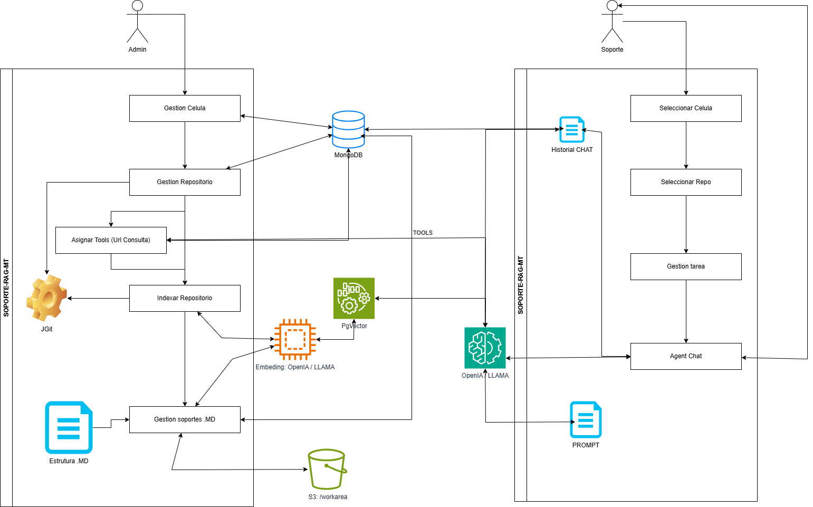

# Entrega — DocViz

**Asignatura:** Estrategias de Integración

**Alcance:** Arquitectura del servicio en **AWS**, **integración con modelos de lenguaje (LLM)**, pipeline **RAG**, gestión de repositorios Git con **JGit** y **herramientas contextuales (@tools)** para enriquecer las respuestas del agente.

---

## Acceso rápido (leer primero)

| Qué | Enlace o dato |
|-----|----------------|
| **Aplicación DocViz (usuario final)** | [http://bsg-frontend-alb-1144449642.us-east-1.elb.amazonaws.com/](http://bsg-frontend-alb-1144449642.us-east-1.elb.amazonaws.com/) |
| **Vídeo demo (Google Drive)** | [DocViz — Sesión 1 (demo)](https://drive.google.com/file/d/1dmq_u4mbxH84YdbjFWH9rkdq_SFsAVGx/view?usp=sharing) |
| **Versiones finales desplegadas (ECS)** | **Frontend** `1.0.32` · **DocViz backend** `3.0.46` · **back-security** `1.0.9` (coinciden con `version.txt` y tags en Docker Hub / Terraform). |
| **Usuarios de prueba** | `admin01` (clave: `Admin123`) / `soporte01` (clave: `Soporte123`). |

---

## 1. Resumen ejecutivo

El sistema **DocViz** es una aplicación **API-first** formada por tres piezas desacopladas:

| Pieza | Rol |
|--------|-----|
| **Frontend** | SPA React + Vite; Nginx sirve estáticos y **proxifica** `/api` y `/security-api` hacia los microservicios internos (mismo origen para el navegador). |
| **back-security** | Autenticación (JWT), usuarios y roles; WebFlux + R2DBC; integración con Redis y DynamoDB para revocación de tokens. |
| **backend DocViz** | API de dominio: Git (JGit), índice vectorial (**pgvector** en PostgreSQL), **RAG** (recuperación + generación con **Spring AI**), work area, soporte, S3, cabecera `X-DocViz-User`. |

El núcleo del curso respecto a **IA aplicada** está en el backend DocViz: **embeddings** para indexar fragmentos del repositorio, **modelo de chat** para responder con contexto recuperado, **Tools (@tools)** para enriquecer el prompt con referencias web según los tags del repositorio, y **JGit** para acceder al contenido de repositorios Git de forma programática sin depender de un binario `git` instalado.

La infraestructura en **AWS** separa entrada pública (ALB, API Gateway) de **ECS Fargate**, Cloud Map, RDS, Redis, DynamoDB y S3, definida en **Terraform** (`terrafom-project/main.tf`). La elección de **AWS frente a Google Cloud** se argumenta en la **sección 5**.

---

## 2. Diagrama de arquitectura general

El siguiente diagrama muestra la arquitectura completa del sistema incluyendo el flujo RAG, la integración con LLMs, el almacenamiento vectorial y las interacciones entre componentes:



---

## 3. Componentes de software (repositorio)

| Directorio | Tecnología | Responsabilidad |
|------------|------------|-----------------|
| `frontend-sesion1` | React, TypeScript, Vite | UI; login → `/security-api`; API DocViz → `/api`; cabeceras `X-DocViz-User` y rol. |
| `back-security-sesion1` | Spring WebFlux, R2DBC | Login, registro, JWT; prefijo `/security-auth` tras el proxy. |
| `backend-sesion1` | Spring Boot 3, JDBC, **Spring AI** | Git (JGit), **pgvector**, **RAG**, S3, soporte, **@tools** (tag-based prompt augmentation); configuración de **chat y embeddings** por perfil Spring. |

**Docker / versionado:** imágenes en Docker Hub; `version.txt` por módulo e imagen referenciada en Terraform (`locals` en `main.tf`).

---

## 4. Integración con LLMs: RAG, Tools y JGit

Esta sección concentra lo pedido por el curso: **qué modelos usamos**, **para qué**, **cómo encajan en el flujo RAG** y cómo se complementan con **herramientas contextuales** y **acceso programático a Git**.

### 4.1 Pipeline RAG completo

El pipeline RAG (Retrieval-Augmented Generation) es una implementación propia sobre Spring AI que conecta el código fuente del repositorio con el modelo de lenguaje:

```
┌─────────────┐    ┌──────────────┐    ┌────────────────┐    ┌─────────────┐    ┌──────────────┐
│  Ingesta    │───▶│  Chunking    │───▶│   Embeddings   │───▶│  pgvector   │    │  Consulta    │
│  (JGit)    │    │  (TextChunker)│    │ (Spring AI)    │    │ (PostgreSQL)│    │  del usuario │
└─────────────┘    └──────────────┘    └────────────────┘    └──────┬──────┘    └──────┬───────┘
                                                                    │                   │
                                                                    │    ┌──────────────┘
                                                                    ▼    ▼
                                                          ┌──────────────────────┐
                                                          │  Búsqueda top-K      │
                                                          │  (similitud coseno)  │
                                                          └──────────┬───────────┘
                                                                     │
                                                                     ▼
                                                          ┌──────────────────────┐
                                                          │  Prompt ensamblado:  │
                                                          │  • System prompt     │
                                                          │  • Historial (12t)   │
                                                          │  • Fragmentos RAG    │
                                                          │  • @tools (URLs)     │
                                                          │  • Pregunta usuario  │
                                                          └──────────┬───────────┘
                                                                     │
                                                                     ▼
                                                          ┌──────────────────────┐
                                                          │  Modelo de Chat      │
                                                          │  (gpt-4o-mini / LLM) │
                                                          │  ─── streaming ───▶  │
                                                          └──────────────────────┘
```

#### Paso 1 — Ingesta

- El texto del repositorio (y fuentes configuradas: markdown de soporte en S3, borradores del work area) se lee mediante **JGit** directamente desde los objetos Git (sin working tree).
- Filtros de exclusión: carpetas de build (`target/`, `node_modules/`, `build/`), archivos binarios y archivos mayores a un umbral de tamaño.
- Clase principal: `VectorIngestService`.

#### Paso 2 — Chunking

- Cada archivo se divide en fragmentos con ventana deslizante: **800 caracteres** de tamaño con **120 caracteres** de overlap.
- Implementación: `TextChunker.chunk(text, chunkSize, chunkOverlap)`.
- El overlap garantiza que el contexto no se pierda en los bordes de fragmento.

#### Paso 3 — Embeddings

- Cada fragmento se vectoriza mediante `SpringAiEmbeddingClient`, que envuelve el `EmbeddingModel` de Spring AI.
- Los embeddings se procesan en lotes configurables (`embedChunkBatchSize = 32`).
- Se soportan dos proveedores:
  - **Producción (perfil `pdn`):** OpenAI `text-embedding-3-small` (768 dimensiones).
  - **Local (perfil `local`):** Ollama con `nomic-embed-text` (768 dimensiones).

#### Paso 4 — Almacenamiento vectorial (pgvector)

- Tabla PostgreSQL `docviz_vector_chunk`:
  - `id` (PK), `namespace`, `user_label`, `source`, `chunk_index`, `embedding vector(768)`.
- Operador de similitud coseno: `<=>` (distancia; score = 1 − distancia).
- Aislamiento por namespace (usuario + repositorio) y soporte para namespaces compartidos en "células" (equipos).
- Clase: `PgVectorStore` (implementa la interfaz `VectorStore`).

#### Paso 5 — Recuperación (query time)

- La pregunta del usuario se embedding-a con el **mismo modelo** que en indexación.
- Se ejecuta búsqueda coseno top-K (por defecto **K = 6**) contra el namespace activo.
- Los chunks recuperados se reconstruyen desde Git (blob cache con prefetch en hilos para rendimiento).
- Se admiten **menciones explícitas**: `@[repo:ruta/archivo]` inyecta el archivo completo, `@[soporte:clave]` inyecta un documento de S3.
- Truncamiento de seguridad: máximo **12.000 caracteres** de contexto para no exceder la ventana del LLM.

#### Paso 6 — Generación (LLM)

- El prompt final se compone de: system prompt + historial conversacional + contexto RAG + @tools + pregunta.
- Se envía vía `ChatClient.prompt().system(…).user(…).stream().content()` (Spring AI, streaming reactivo Flux).
- El modelo puede devolver una respuesta directa, un **plan multi-paso** (JSON con pasos y archivos), o **propuestas YAML** para crear/editar archivos en el repositorio.

### 4.2 Tools — Herramientas contextuales por tags (@tools)

El sistema implementa un mecanismo de **prompt augmentation basado en tags** que enriquece las respuestas del agente con referencias web relevantes:

| Concepto | Detalle |
|----------|---------|
| **Qué son** | URLs de documentación oficial y paquetes asociadas a tecnologías (Java, Spring, React, Python, SQL, Angular, COBOL, Oracle). |
| **Cómo se activan** | Cada repositorio/célula tiene tags configurados (CSV). Al preparar el contexto RAG, `TagToolRegistry.buildPromptAugmentationForTagsCsv()` genera un bloque de texto con las URLs pertinentes. |
| **Dónde se inyectan** | Se agregan al final del contexto RAG, marcados como `Referencias web (@tools)`. |
| **Qué hace el modelo con ellas** | Puede citarlas como fuentes externas, recomendar dependencias con versión, o indicar documentación relevante. El modelo **no navega** las URLs en tiempo real, pero las usa como orientación verificada. |

**Ejemplo de tags y herramientas:**

| Tag | URLs de referencia |
|-----|-------------------|
| Java | Maven Repository, Java SE Docs (Oracle) |
| Spring | Spring Boot Reference, Spring Framework |
| React | react.dev, npmjs.com |
| Python | PyPI, Python 3 Docs |
| SQL | PostgreSQL Docs, SQL Commands Reference |
| Angular | angular.dev, Angular CLI |
| COBOL | IBM Enterprise COBOL, GnuCOBOL |

Clase: `TagToolRegistry` (`com.bsg.docviz.service`).

### 4.3 JGit — Acceso programático a repositorios Git

El sistema usa **Eclipse JGit** (implementación Java pura de Git) para todas las operaciones sobre repositorios, sin requerir el binario `git` instalado en el servidor:

| Operación | Implementación |
|-----------|---------------|
| **Clonar repositorios** | `cloneMetadataOnly()` — clona sin checkout de working tree (solo objetos Git), con soporte de submódulos. |
| **Listar archivos** | `listTrackedFilePaths()` — recorre el tree del commit con `TreeWalk` recursivo; resuelve submódulos (GITLINK). |
| **Leer contenido** | `readBlob()` — lee bytes directamente del object store sin materializar en disco; cruza fronteras de submódulo. |
| **Tamaño de objetos** | `blobSizeBytes()` — consulta tamaño sin descomprimir todo el blob (para filtros de ingesta). |
| **Resolución de revisión** | `resolveListingRevision()` — prueba HEAD, luego origin/main, origin/master, origin/develop. |
| **Checkout selectivo** | `checkoutPath()` — materializa un archivo específico al working tree cuando se necesita lectura convencional. |
| **Mitigaciones** | `applyRepoMitigations()` — desactiva GC automático y commit-graph para reducir I/O en clones efímeros. |

**Arquitectura**: interfaz `GitEngine` con implementación `JGitGitEngine`, consumida por `GitRepositoryService` (puerto de salida hexagonal). Esto permite que la ingesta RAG y la visualización lean archivos del repositorio sin dependencias del SO.

### 4.4 Historial conversacional (multi-turno)

- Se persisten hasta **12 turnos** previos (pregunta + respuesta) por conversación.
- Cada respuesta histórica se trunca a **2.000 caracteres** antes de inyectarse en el prompt.
- El `conversationId` se deriva del usuario, tarea (HU) y célula — permite contextos de diálogo separados por alcance.
- Servicio: `ChatConversationPersistenceService`.

### 4.5 Planificación multi-paso

Cuando el modelo detecta una tarea compleja, puede devolver un **plan JSON** con pasos y archivos involucrados:

1. El primer paso RAG genera el plan.
2. Cada paso del plan se ejecuta como una consulta RAG independiente con prompt focalizado.
3. Timeout de **3 minutos** por paso para evitar bloqueos.
4. Los resultados se acumulan y el cliente recibe streaming NDJSON continuo.

Clase: `RagChatTurnService`.

### 4.6 Propuestas de archivos (Work Area)

Cuando el usuario solicita crear o editar archivos, el modelo genera un bloque YAML `proposals:` con:
- `path`: ruta con prefijo `REPO/…` (repositorio) o `LOCAL/…` (soporte S3).
- `blocks`: lista de ediciones con líneas de inicio/fin y tipo (REPLACE, NEW, DELETE).
- El backend versionan los borradores (`_v1`, `_v2`, …) y los almacena en el work area (S3).
- Los borradores se indexan automáticamente en el vector store para que futuras consultas RAG los consideren.

---

## 5. Modelos LLM por entorno

### 5.1 Producción en AWS (perfil `pdn`)

En ECS el backend arranca con **`SPRING_PROFILES_ACTIVE=pdn`**. La configuración activa **OpenAI** para chat y embeddings vía API HTTPS.

| Rol | Modelo | Detalle |
|-----|--------|---------|
| **Embeddings** (índice + consulta RAG) | **`text-embedding-3-small`** | Modelo de embedding denso de OpenAI; 768 dimensiones alineadas con el esquema pgvector. |
| **Chat** (respuesta al usuario con contexto recuperado) | **`gpt-4o-mini`** | Modelo conversacional vía Chat Completions; configurable con **`OPENAI_CHAT_MODEL`**. |

### 5.2 Desarrollo local (perfil `local`)

| Rol | Modelo por defecto |
|-----|-------------------|
| **Chat** | **`llama3.2`** (override `OLLAMA_MODEL`) |
| **Embeddings** | **`nomic-embed-text`** (768 dimensiones) |

URL configurable: `OLLAMA_BASE_URL` (típicamente `http://127.0.0.1:11434`).

### 5.3 Perfil intermedio `develop`

Similar a producción: **`gpt-4o-mini`** para chat y **`text-embedding-3-small`** para embeddings, útil para entornos de integración sin ECS.

---

## 6. Por qué AWS frente a Google Cloud Platform (GCP)

Elegimos **AWS** por criterios prácticos del curso: la arquitectura ya integraba ALB/NLB, ECS Fargate, API Gateway + VPC Link, RDS, ElastiCache, DynamoDB, S3 y Cloud Map con **Terraform** en us-east-1. Reproducir lo mismo en GCP supondría otro stack (Cloud Run/GKE, Memorystore, Cloud SQL) y otro ciclo de integración sin sumar al objetivo pedagógico. El **chat y los embeddings** van por **OpenAI API** desde Spring AI, así que el modelo no viene de Bedrock ni de Vertex: la nube cubre compute, red y datos. **GCP sería viable**, pero priorizamos centrarnos en **RAG, Spring AI, Tools y escalabilidad** en lugar de portar la topología.

---

## 7. Infraestructura AWS (Terraform)

| Recurso | Uso en el proyecto |
|---------|---------------------|
| **ECS Fargate** (`bsg-cluster`) | Tres servicios: `bsg-frontend-service`, `bsg-back-security-service`, `bsg-backend-service`; logs en **CloudWatch**. |
| **ALB** (`bsg-frontend-alb`) | Entrada HTTP pública hacia el task del frontend (target group puerto 80). |
| **NLB internos** | TCP **8081** (security) y **8080** (DocViz); integración API Gateway por **ARN de listener**. |
| **API Gateway HTTP API** | Rutas `/security-auth/{proxy+}` y `/docviz/{proxy+}` → **HTTP_PROXY** + **VPC Link**. |
| **Cloud Map** (`bsg.internal`) | **`security.bsg.internal`** y **`docviz.bsg.internal`**. |
| **RDS PostgreSQL** | Bases `bsg_security` y `docviz` (con extensión **pgvector** para almacenamiento vectorial). |
| **ElastiCache Redis** | Caché de seguridad (tokens, sesiones). |
| **DynamoDB** (`bsg_revoked_tokens`) | Tokens revocados; IAM en task role del security. |
| **S3** (tres buckets) | Soporte (documentos markdown), borradores (propuestas versionadas), work area (archivos generados). |
| **IAM** | Roles ECS y políticas DynamoDB / S3 según servicio. |

---

## 8. Cómo cumplimos los requisitos de infraestructura escalable

### 8.1 Separación de responsabilidades y microservicios

- **Seguridad** y **DocViz** son despliegues distintos, prefijos HTTP claros (`/security-auth` vs `/docviz`).
- El **frontend** solo sirve UI y proxy; la **IA** reside en el backend DocViz.

### 8.2 Escalabilidad horizontal y desacoplamiento

- **ECS Fargate** permite escalar réplicas por servicio (el backend DocViz puede escalarse según carga de ingesta y chat).
- **NLB**, **Cloud Map** y **API Gateway** desacoplan clientes de la ubicación exacta de los tasks.

### 8.3 Seguridad

- JWT en **back-security**; revocación en **DynamoDB**; secretos de OpenAI fuera del repo (variables Terraform sensibles).

### 8.4 Persistencia y servicios gestionados

- **RDS + pgvector** para vectores y datos relacionales; **S3** para objetos; **Redis** para security.

### 8.5 Observabilidad

- **CloudWatch Logs** por servicio; health checks en balanceadores y ECS.

### 8.6 Infraestructura como código

- **Terraform** en `terrafom-project/main.tf`.

### 8.7 Experiencia de usuario

- **Mismo origen** en el ALB para la SPA; CORS en API Gateway para llamadas directas al endpoint público.

---

## 9. Evaluación y calidad del LLM — Casos de prueba

La evaluación funcional del sistema RAG se realiza con **casos manuales documentados** ejecutados en la demo en vivo (véase [vídeo en Google Drive](https://drive.google.com/file/d/1dmq_u4mbxH84YdbjFWH9rkdq_SFsAVGx/view?usp=sharing)). A continuación se resumen los escenarios cubiertos:

| # | Escenario | Entrada (pregunta al agente) | Resultado esperado | Validación |
|---|-----------|------------------------------|-------------------|------------|
| 1 | **Consulta informativa sobre el código** | "¿Qué hace la clase AuthController?" | Respuesta con citas `[Fuente: …]` del código real del repositorio indexado | ✅ Responde con fragmentos del repo, sin inventar |
| 2 | **RAG sin índice** | Pregunta en un repo no indexado | Fallback: "sin fragmentos indexados", respuesta general sin inventar rutas | ✅ No alucina contenido del proyecto |
| 3 | **Mención explícita @[repo:…]** | "@[repo:src/main/java/…/SecurityConfig.java] explícame este archivo" | Inyecta archivo completo en contexto y responde sobre él | ✅ Archivo inyectado correctamente |
| 4 | **Propuesta de edición (proposals YAML)** | "Modifica el docker-compose para quitar Redis" | Plan + bloque ```yaml con proposals (path, blocks, type REPLACE/DELETE) | ✅ YAML parseable, path correcto |
| 5 | **Planificación multi-paso** | Tarea compleja con múltiples archivos involucrados | JSON plan con pasos y archivos → ejecución paso a paso | ✅ Cada paso genera respuesta focalizada |
| 6 | **Historial conversacional** | Segunda pregunta referenciando la primera ("y eso cómo se conecta con…") | Continuidad: modelo usa contexto del turno anterior | ✅ Respuesta coherente con historial |
| 7 | **Tools (@tools) — referencias web** | Pregunta en repo con tag "Spring" | Bloque "Referencias web (@tools)" con URLs de Spring Docs | ✅ URLs inyectadas en respuesta |
| 8 | **Ingesta completa del repositorio** | Botón "Indexar" en la UI | Streaming NDJSON de progreso → chunks indexados en pgvector | ✅ Count > 0, namespace correcto |
| 9 | **Documento de soporte (S3)** | Subir markdown de soporte y preguntar sobre él | RAG recupera fragmentos del documento de soporte | ✅ Fuente marcada como soporte |
| 10 | **Límite de contexto** | Repo grande con muchos archivos indexados | Truncamiento a 12.000 chars con aviso, sin error HTTP 400 | ✅ Sin crash del modelo |

**Método de validación:** Los casos se ejecutan en la demo en vivo (vídeo adjunto) y se verifica manualmente que las respuestas cumplan los criterios de la columna "Resultado esperado". El sistema no incluye un framework de eval automatizado (tipo LLM-as-judge), pero los 10 escenarios cubren los flujos principales del pipeline RAG.

---

## 10. Despliegue de aplicación

- Build/push de imágenes según **DOCKERHUB.md**.
- Actualizar **task definitions** y servicios ECS; frontend con `DOCVIZ_UPSTREAM`, `SECURITY_UPSTREAM`, `NGINX_RESOLVER` acordes a Cloud Map.

---

## 11. Anexo para el evaluador: URL pública, vídeo en Drive y credenciales de prueba

### 11.1 URL de la aplicación (usuario final)

| Campo | Valor |
|--------|--------|
| **URL pública DocViz (SPA)** | [http://bsg-frontend-alb-1144449642.us-east-1.elb.amazonaws.com/](http://bsg-frontend-alb-1144449642.us-east-1.elb.amazonaws.com/) |

### 11.2 Vídeo y versiones finales de los servicios

#### Vídeo (Google Drive)

| Campo | Valor |
|--------|--------|
| **Enlace al vídeo** | [Ver en Google Drive](https://drive.google.com/file/d/1dmq_u4mbxH84YdbjFWH9rkdq_SFsAVGx/view?usp=sharing) |

#### Versiones finales desplegadas (imágenes ECS / Docker Hub)

| Servicio | Tag / versión | Archivo `version.txt` |
|----------|----------------|------------------------|
| **Frontend** (Nginx + SPA) | **1.0.32** | `frontend-sesion1/version.txt` |
| **DocViz backend** | **3.0.46** | `backend-sesion1/version.txt` |
| **back-security** | **1.0.9** | `back-security-sesion1/version.txt` |

Imágenes Docker Hub: `mmercado94/frontend-sesion1:<tag>`, `mmercado94/backend-sesion1:<tag>`, `mmercado94/back-security-sesion1:<tag>`.

### 11.3 Credenciales para pruebas

| Usuario | Contraseña | Rol |
|---------|------------|-----|
| `admin01` | `Admin123` | Administrador (`ROLE_ADMINISTRATOR`) |
| `soporte01` | `Soporte123` | Soporte (`ROLE_SUPPORT`) |

**Nota:** Son credenciales para demostración académica. En un despliegue real conviene rotar contraseñas y no versionar secretos.

---

*Documento para entrega académica — alineado al repositorio, Spring AI, JGit, Tools (@tools), pgvector y Terraform.*
